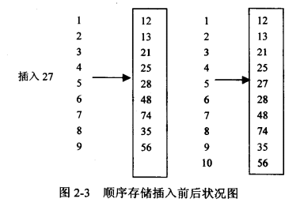

# 数组

数组是存储空间紧邻的，需要提前申明数组大小，用索引作为相对位置并计算出实际位置来存储获取值的数据结构。

假设一个数组第一个元素的存储地址是a0，每个元素的大小是c，则第n(从0开始)的元素的地址为a0 + nc。

信箱就是一个数组的例子。假设信箱从100开始，当我们要找105的时候我们会越过前5个邮箱，找到105。

数组可以是多维的，即数组的每个成员可以是数组（指针）。

数组的空间复杂度为O(n)。


## 优缺点

* 优点

1. 简单直观
2. 如果已知索引，添加，修改，查找速度非常快
3. 分布集中，当数组填满时空间使用率高

* 缺点

1. 需要提前申明大小，如果超出大小需要申明新的数组
2. 需要知道索引才方便进行操作，非则需要遍历
3. 当数组未满时有很多的空间浪费

## 常见使用场景

1. 已知数据长度
2. 经常需要遍历但是不怎么需要添加删除
3. 对查询效率要求不高

## 操作

0. 初始化

一般数组的初始化需要申明数组长度好申请内存大小

```

// java
// python中list和tuple都不是这里提到的array

int[] arr = new int[10];

```

1. 插入

插入一个值的时间复杂度是O(n)。

最小是O(1)，最大是O(n)，平均是O((n - 1) / 2)即O(n)。

O(n) = (n-1 + ... + 0) / n = O((n - 1) / 2);



```

// 移动插入位置后的元素到后一位
for (int right = length - 2; right >= i && i >= 0; right--) {
    arr[right] = arr[right + 1];
}
// 插入元素
arr[i] = data;


```

2. 删除

删除一个值的时间复杂度时O(n)。

最小是O(1)，最大是O(n)，平均是O(n)

删除和插入类似，都需要将删除位置后面的元素移动一个位置。

3. 更新

时间复杂度是O(1)

```

arr[i] = data;

```

4. 查询

时间复杂度是O(1)

```

arr[i]

```

5. 遍历

```

for (var i = 0; i < arr.length; i++) {
    
}

```