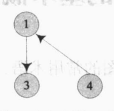
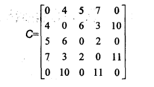
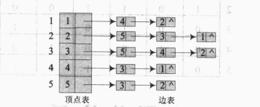
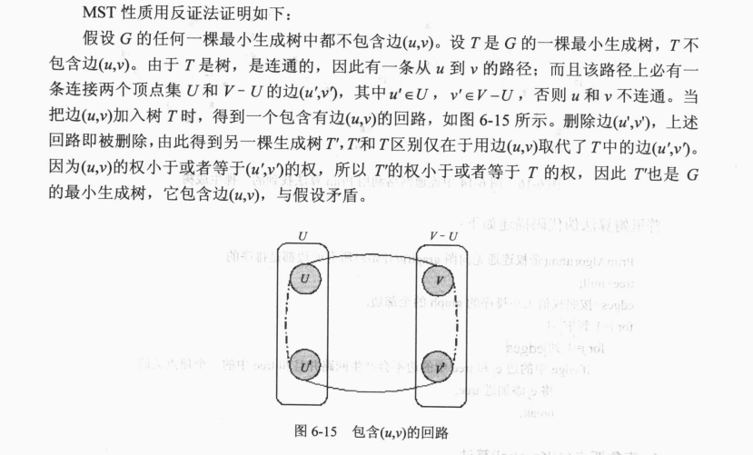

# 图(gragh)

图可以被当作是更复杂的树，因为关系更加复杂。

图是一个集合，这个集合是元素(顶点)和元素间的关系（边）。



## 术语

* 有向图和无向图

有向图指关系是有方向的。比如你爸爸是你爸爸，这是单向的。

无向图是指关系是没有方向的。比如你爸爸是你亲人。

* 完全图

任意两个元素间都有关系的图叫做完全图。

* 邻接点

有关系的两个元素称之为邻接点。

* 相关边

两个邻接点之间的关系称为相关边。

* 度

与每个边相连接的边的数叫做度，有向图中，指向该点的称之为入度，从该点出发的称之为出度。

* 路径

从某一个元素到一个元素经过的所有关系。

* 回路

若一个元素可以有一条路径指向自己，则这条路径称之为回路。

* 连通

无向图中两个点之间有路径。

* 连通图

任意两个点都是连通的图叫做连通图。

* 权

路径的值

## 实现

1。 矩阵

一个有n个元素的图会用一个n * n的二维数组，它的权为对应数组节点的值。

缺点是当非完全图时，空间利用率极低，所以一般不会用二维数组。



2. 邻接表



## 操作

* 深度优先

```
1. 选择一个未访问的节点，称之为当前节点
2. 访问当前节点
3. 选择一个当前节点未访问的邻接点作为当前节点
4. 重复1，2，3直到没有没有没访问过的邻接点
5. 回溯到前继节点，重复2，3，4知道无法回溯
6. 如果图中还有未访问的节点，重复1，2，3，4，5
```

* 广度优先

```
1. 选择一个未访问的节点，称之为当前节点
2. 访问当前节点
3. 选择一个当前节点未访问的邻接点作为当前节点
4. 回溯到前继节点，重复3直到全都访问过了
5. 从访问过的节点中按照顺序重复2，3，4直到都已访问过
6. 如果图中还有未访问的节点，重复1，2，3，4，5
```

## 最小生成树

生成树是一个连通图的子图，且要求：

1. 包含所有顶点
2. 还是连通的
3. 边或者权重比其他的生成树少或一样

生成树具有的特性是

1. 去掉任意一个边就会不连通
2. 边或者权重尽可能的少

所以最小生成树经常被用来考虑一些路径最短的问题，比如城市之间架设光缆，需要城市间连通，把城市作为定点，光缆作为边，城市间的距离作为权重，生成一个最小生成树，可以使光缆铺设距离最短。

通过遍历（广度或深度）都可以获得一个最小生成树，深度优先的称为DFS生成树，广度优先的称为BFS生成树。

最小生成树一般是值带权的生成树且权值最小的生成树。

最小生成树具有一个性质叫MST：

若连通图的顶点集为集合U，剩下的顶点为集合V，则U中的任意一个点和V中的任意一个点如果能形成边且权值在其他类似的边中是最小，则该边一定在最小生成树中。




有两大算法Prim算法和 算法利用了这个性质来生成最小生成树。

* Prim算法

选择一个顶点为集合U，剩下的顶点和边的集合为V，取U到V的最小权的边到U并且把边的顶点也加到U中，如此反复。直到所有顶点都被取到且边的数量为n - 1

* Kruskal算法

将所有顶点设为集合U，边的集合为V，从V中取最小权的边如果U中已包含这条边的两个顶点则继续，否则将这条边加入集合U直到边的数量为n - 1

## 最短路径问题

给出一个图和图中的一个顶点，得出该顶点到图中其他顶点的最短路径。

* Dijkstra算法

将所有的顶点分成两个集合U和V，所求顶点为E，U中是我们要计算最短路径的顶点，V中为剩余的顶点。

计算V中顶点到U中顶点的路径长度，如果相邻，则权的大小为路径长度，否则则为无限大。

从算出的路径长度中取出有最小长度的边，权为P，将这条边的不在U中的顶点E'加入U中，并且E到该顶点的最短路径为P。

之后重新计算V中顶点的路径长度，如果与新加入的顶点相邻，则路径长度为P + E'到该顶点的权值之和与当前权值的较小值。

之后再从V中找出路径最短的以此往复直到取出所有顶点。

## 拓扑排序

事物之间会有依赖关系，拓扑排序可以用来解决依赖关系即当事物发生有先后时应该先进行哪个事务。

将事务作为顶点，依赖关系为边。整个图为有向图，后进行的事务有一条边指向先进行的事务。

当有回路时，不能拓扑排序。

算法:

1. 选择一个入度为0的点

2. 去掉与该点所有相关的出度

3. 重复1和2

