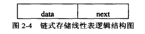

# 链表

链表是一种非顺序的线性表，通过元素持有相邻元素的地址来联结到相邻元素。



上图是链表元素的一种实现，data存储数据，next指向后一个元素

## 优缺点

* 优点

1. 插入非常快
2. 不用事先申明线性表大小

* 缺点

1. 查找特别慢，需要从头或从尾遍历
2. 需要维护指针

## 单链表

单链表有唯一的一个指针指向前一个元素或后一个元素

## 双链表

双链表有两个指针指向前一个元素和后一个元素

相比于单链表，双链表可以从后往前遍历也可以回溯，但缺点是需要同时维护两个指针。

## 操作

1. 初始化

```

class Node {
    
}


```