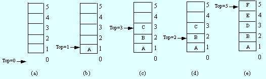

# 栈 (stack)

栈又称堆栈(不是堆)，是限制在表的一端进行插入和删除的线性表。

栈的每次删除叫出栈(pop)，插入加进栈(push)，当栈满了以后再进栈的情况叫上溢，空栈时出栈叫下溢。

堆栈是实现LIFO的常用数据结构。

Stack实现见[这里](../example/stack.py)

## 顺序栈

使用数组实现的栈

## 链式栈

使用链表实现的栈

## 使用场景

1. 先进后出的时候，比如说函数调用的实现就用到了栈



## 操作

空间复杂度是O(n)

1. 进栈

时间复杂度是O(1)

```

stack.push(data)

```

2. 出栈

时间复杂度是O(1)

```

stack.pop()

```

## 


