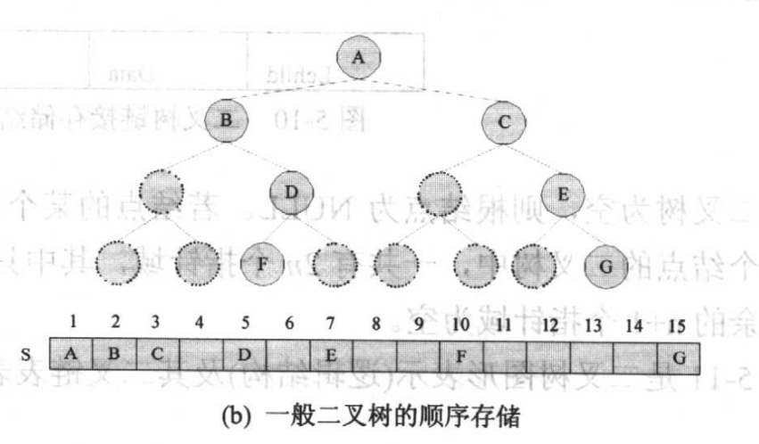
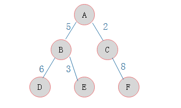
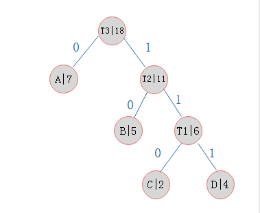

# 二叉树(binary tree)

二叉树是每个节点最多只有两个子节点的树。

层数为k且总节点数为2 * k - 1的二叉树为满二叉树。

所有节点要么度数为2要么度数为0的则是完全二叉树。满二叉树是完全二叉树但完全二叉树不是满二叉树。

## 性质

1. 第i(i >= 1)层上节点数最多为2^i-1

2. 高度为k的二叉树最多有2^k - 1个节点

3. 对于任何二叉树n0, n1, n2分别表示为度数为0，1，2的结点个数，则n0 = n2 + 1

    设n为总节点数，n = n0 + n1 + n2。

    所有的子节点数为2 * n2 + n1

    只有根节点没有子节点，所以n = 2 * n2 + n1 + 1

    所以n0 = n2 + 1

4. 有n个节点的完全二叉树的高度为Math.floor(log2(n)) + 1

    2 ^ (k - 1) - 1 < n <= 2 ^ k - 1

    所以k - 1 <= log2n < k

    所以k = Math.floor(log2(n)) + 1

5. 非空满二叉树的叶节点树等于其分支节点数加1

6. 一颗非空二叉树孔子书的数目等于其节点数目加1

## 实现

1. 数组实现

    

    数组实现的缺点是必然会有很多节点可能没有设置，浪费了存储空间。

2. [链式实现](../example/binaryTree.py)

    一般我们会使用链式的去实现。

# 操作

二叉树树的空间复杂度一般是O(n)

1. 插入

时间复杂度为O(1)

```

tree.appendChild(data)

```

2. 删除

时间复杂度为O(1)

```

tree.removeChild()

```

3. 更新

时间复杂度为O(1)

```
tree.data = data

```

4. 遍历

遍历分为先序遍历，中序遍历，后序遍历，深度遍历和广度遍历。时间复杂度都为O(n)。

先序遍历是指先访问根节点，再访问左子树，再访问右子树。

```

tree.preOrder()

```

中序遍历是指先访问左子树，再访问根节点，再访问右子树

```

tree.inOrder()

```

后序遍历是指先访问左子树，再访问右子树，再访问根节点

```
tree.postOrder()

```

广度遍历是从根节点开始，访问完一层后访问下一层

```

tree.breadthFirstSearch()

```

深度遍历是先访问树的根节点，再访问左节点，直到左节点为空后访问右节点

```

tree.depthFirstSearch()

```

5. 一些应用

* 霍夫曼树(Huffman tree)

也被叫做最优二叉树。一种路径带权重的二叉树，经常被用来处理数据压缩和编码的问题。

带权路径长度是指节点到根节点的路径长度与权的积。树的带权路径长度是指所有叶子节点的带权路径长度之和。



比如这棵树是 6 * 2 + 3 * 2 + 8 * 2 = 34。

当一个有权重的二叉树的带权路径长度`最小`时，称之为霍夫曼树。

霍夫曼编码是指使用霍夫曼树构造的编码(将字符翻译成二进制位)。原理是字符的出现次数为权重，叶子节点到根节点的路径长度为某个字符的编码长度，当带权路径长度最小时，获得的编码最短。

假设要传输的信息为AACBCAADDBBADDAABB。

构建出的霍夫曼树如图：



算法如下：

```

1. 按照每个字符出现的次数设置每个字符的权重，如A是7因为出现了7次
2. 选取权重最小的两个节点
3. 将权重更小的节点作为左节点，权重更大的节点作为右节点产生一个二叉树，产生的树的根节点的权重是左右节点权重之和
4. 选取剩下的权重最小的节点作为左节点，之前构造的树作为右节点，新产生的树的根节点的权重是左右节点权重之和
5. 循环3和4直到没有节点
6. 将左边的路径作为0，右边的路径作为1，从根节点到一个叶节点的路径上的0和1就是这个字符的编码，如C是110

```

基本想法是出现最多的字符应该编码最短，所以应该更接近根节点。


