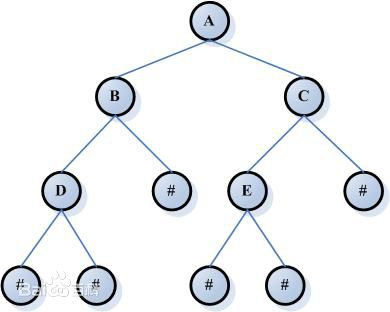

# 树(tree)

树是若干个节点的集合，可以是：
1. 一个空集。
2. 一个节点（称之为根节点）
3. 一个节点和若干个树，且这个节点仅和树的根节点存在关系（这个节点是那些树的父节点）

树在生活中经常有体现，比如

但有一些常常认为是树的并不是树，比如说家族的族谱，因为不只一个根节点。

## 术语

树的构造比较复杂，所以有很多术语，以

为例

1. 根节点

    树的唯一一个没有父节点的节点。即图中的A。

2. 路径

    任意两个节点之间的关系的集合。比如D -> B  -> A。

3. 父节点

    一个是到根节点的路径上经过的节点中的前一个节点。比如A是B的父节点。一个节点当且仅有一个父节点。

4. 子节点

    与父节点对应的节点，比父节点到根节点的路径长大1并且经过父节点。比如B和C是A的子节点。一个节点可以有多个子节点。

5. 兄弟节点

    有同一个父节点且到根节点路径长度一样的节点互称兄弟节点。比如B和C就是兄弟节点。

6. 先祖节点

    父节点以及父节点的先祖节点。比如D的先祖节点有A和B。

7. 叶节点

    没有子节点的节点。比如D和E。

8. 高度

    从某个叶节点到某个节点的路径长度。叶节点的高度为0。

9. 深度

    从根节点到某一个节点的路径长度。根节点的深度为0。比如D的深度是2。

10. 度数

    一个节点的子节点的数量

## 使用场景

    树因为分叉的性质，使得某些搜索的操作可以获得O(logN)的时间复杂度，所以常常被用来搜索或建立索引。

    树因为有父子关系，所以使得路径可以被复用，所以也常常被用来压缩和编码。

## 类型

1. [二叉树](./binaryTree.md)

2. 平衡二叉树

3. 红黑树

4. B树，B+树

